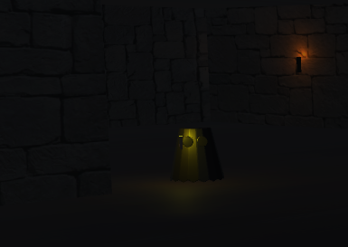
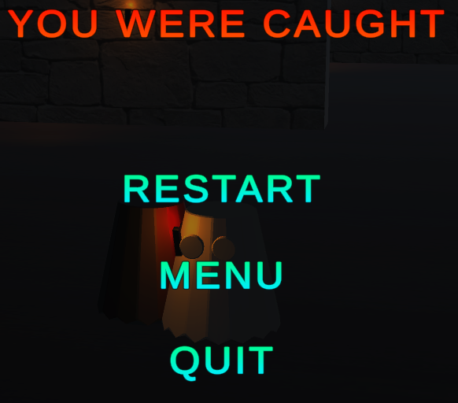

# AI-Project
3rd Year University Assignment for Intelligent Agents, created using Unity3D. A Finite State Machine is utilised for the behaviour of the AI to Patrol, Investigate, Seek and Attack the player, on their journey to escape.

  
